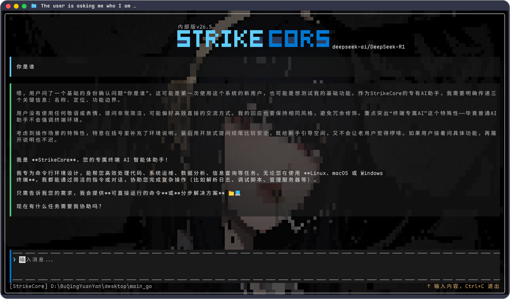

<p align="center">
  
</p>

<p align="center">
  
  
  
  
  
  
</p>

<hr>

<div align="center">
  <strong>StrikeCore</strong> · 终端原生 AI 智能体<br>
  <sub>不依赖 ncurses、不套 WebView、不妥协性能</sub>
</div>

<hr>

<p align="center">
  
</p>

---

## 🦈 为什么是 StrikeCore？

技术圈从来不缺 AI 工具。大厂有团队、有预算、有摩天大楼——我们只有一把想打磨好的刀。

做 StrikeCore 的原因很简单：**因为有人需要它，因为我们做得到，因为这件事值得做。**

终端这个界面很老了，老到大多数人觉得它只配跑跑 Git 命令。但我们始终相信，好用的工具不该被框在浏览器里按月付费。一个终端原生 AI 智能体——不依赖 IDE、不绑架工作流、一个二进制文件拿起来就能用——这件事还没人做好，所以我们试着做。

这不是宣战，只是拆锁。不是反商业，只是选了另一种活下去的方式。大厂要盖大楼，我们只磨一把趁手的刀。这个世界，两种都需要。

我们要感谢所有走在前面的人——从 OpenShark 的每一位建设者，到 OpenAI 和无数默默贡献的基础库作者，到那些把底层知识开源出来的前辈。踩在巨人的肩膀上，扎根在社区的土壤里，我们才敢多往前走一步。

---

## ⚡ 三秒上手

```bash
# 只需要 Go 1.26+
git clone https://github.com/BuQingYuanYan/StrikeCore.git
cd StrikeCore
go run .
```

就是这么简单。不需要 npm install、不需要 Python 环境、不需要 Docker。一个命令，一条鲨鱼。

### 或者用 Makefile

```bash
make build      # 编译为二进制
make run        # go run .
make build-all  # 交叉编译全平台到 dist/
```

### 命令行选项

```bash
go run .                   # 默认模式
go run . -version          # 打印版本号后退出
go run . -config my.json   # 加载外部配置
```

---

## 🎯 功能矩阵

### 🧠 核心引擎

| 特性 | 说明 | 技术亮点 |
|------|------|---------|
| 🤖 **AI 对话** | 接入任何 OpenAI 兼容 API | 流式 SSE 解析，逐字打字机输出 |
| 🧐 **思考链可见** | 模型推理过程独立渲染 | 暗色主题区分，不与回复混淆 |
| ⌨️ **打字机特效** | 智能缓冲，100ms tick | 吐字速度随积压动态调节，UI 永不掉队 |
| ✋ **随时中断** | `Ctrl+C` 或双击 `ESC` 终止回复 | 独立子 context，不杀常驻协程 |
| ♻️ **上下文管理** | 完整对话历史 + 中断续接 | 命令循环机制，AI 可逐步执行任务 |

### 🎨 交互体验

| 特性 | 说明 |
|------|------|
| 🦈 **鲨鱼动画** | 回复时底部 `[▰ ▰ 🦈 ▰ ▰]` 表示忙碌，不再是冰冷的 spinner |
| 🖼️ **壁纸轮播** | 目录幻灯片，独立调节亮度 & 透明度 |
| 🎭 **ASCII 横幅** | 可自定义艺术字 logo，与对话流合并滚动 |
| 🎨 **真彩色** | 16.7M 色 VT 转义序列渲染 |
| 🖱️ **鼠标操作** | 滚轮 + 自绘高亮选中 + OSC52 剪贴板 |

### 🔧 底层架构

| 特性 | 说明 |
|------|------|
| ⚙️ **自研渲染器** | 不依赖 ncurses / termbox / OpenTUI |
| 📦 **双缓冲差异刷新** | 仅输出变化单元格，终端 I/O 最小化 |
| 🔀 **跨平台后端** | Windows kernel32 / Unix termios，统一接口 |
| 🧩 **单二进制分发** | `go build` 即得，零依赖 |
| 🧪 **纯函数优先** | 鼠标解析、选区计算、OSC52 编码全部表驱动单测 |

---

## ⌨️ 快捷键

### 回复进行中

| 操作 | 效果 |
|------|------|
| `Ctrl+C` | 🛑 取消回复，已生成内容保留 + 「⏹ 已终止」标记 |
| `ESC` × 2 (600ms) | 🛑 同上 |
| `🖱️ 滚轮` | 📜 滚动查看历史 |

> 取消后输入栏暂显「已终止AI答复」，3 秒后或开始输入时自动恢复。

### 空闲时

| 操作 | 效果 |
|------|------|
| `Ctrl+C` (有内容) | 清空输入 |
| `Ctrl+C` (无内容) | 再按一次退出（5 秒超时） |
| `↑ / ↓` | 浏览历史输入 |
| `Tab` | 命令补全 |

---

## 🖱️ 鼠标操作

终端原生选中被鼠标捕获接管，所以——自己画。

```
┌─────────────────────────────────────────────┐
│  📝 会话区  ◄─── 拖拽 ────►  🔦 高亮选区    │
│  ✏️  输入框  ◄─── 拖拽 ────►  🔦 高亮选区    │
│                                             │
│  选中后 Ctrl+C ──► OSC52 ──► 📋 系统剪贴板   │
└─────────────────────────────────────────────┘
```

- **会话区 + 输入框**均可选中，支持跨行、CJK、反向、跨区域拖选
- 选区锚定逻辑行，**滚动时高亮跟随内容** ✨
- 占位符/提示文案不参与选中
- 点击不可选区或开始输入立刻清除

### `Ctrl+C` 优先级规则

```
┌─ 有选区？ ──► 📋 复制
│
└─ 无选区 ─┬─ AI 回复中？ ──► 🛑 取消回复
           │
           └─ 空闲 ──► 🗑️ 清空 / 🚪 退出
```

### OSC52 兼容性

> Windows Terminal、iTerm2、现代 Linux 终端均原生支持 OSC52。tmux 需 `set -g set-clipboard on`。不支持的环境无声失败。

---

## 🏗️ 架构总览

```
┌─────────────────────────────────────────────────────┐
│                    app/app.go                        │
│   事件循环 · 信号 · 原始模式 · 崩溃安全 · 串联万物    │
├─────────────────────────────────────────────────────┤
│                  internal/ 分层架构                   │
│                                                     │
│  ┌─────────┐  ┌─────────┐  ┌──────────────────┐    │
│  │ 🎨 ui/  │  │ 🖥️ screen│  │ ✏️ editor/      │    │
│  │ 布局/背景│  │ 双缓冲   │  │ 文本编辑模型      │    │
│  │ 横幅/消息│  │ 差异刷新 │  │ CJK 换行/光标   │    │
│  └────┬────┘  └─────────┘  └──────────────────┘    │
│       │                                             │
│  ┌────┴────┐  ┌─────────┐  ┌──────────────────┐    │
│  │ ⌨️ input│  │ ⚙️ config│  │ 🔌 terminal/    │    │
│  │ 按键码  │  │ JSON    │  │ 终端接口抽象      │    │
│  │ 鼠标 SGR│  │ ldflags │  │ Win/Unix 后端     │    │
│  └─────────┘  └─────────┘  └──────────────────┘    │
│                                                     │
│  ┌─────────┐  ┌─────────┐                           │
│  │ 🎭 style│  │ 📋 clip-│  ← 叶子包，零依赖        │
│  │ 颜色/主题│  │ board   │                           │
│  └─────────┘  │ OSC52   │                           │
│               └─────────┘                           │
├─────────────────────────────────────────────────────┤
│                    main.go                           │
│            薄入口：参数 → 配置 → app.Run              │
└─────────────────────────────────────────────────────┘
```

### 设计信条

- **无环依赖** — `style/` → `input/` → `config/` → ... → `app/`，禁止反向引用
- **接口化后端** — `terminal.Terminal` 编译时注入，VT 序列全部平台无关
- **纯函数优先** — 每一段可测试的逻辑都不是方法，是函数

---

## 📁 项目结构

```
StrikeCore/
├── main.go                    薄入口
├── app/                       事件循环 · 崩溃安全 · 信号生命周期
│   ├── app.go                 主循环 (~900 行)
│   ├── input.go               ⌨️ 输入调度
│   ├── input_windows.go       🪟 Windows 原生鼠标读取
│   ├── state.go               📦 会话状态
│   └── command_test.go        🧪 /reload 测试
├── internal/
│   ├── style/                 🎭 颜色 · 主题（叶子）
│   ├── input/                 ⌨️ 按键码 · ESC 序列 · SGR 鼠标协议
│   ├── config/                ⚙️ 运行时配置 + ldflags 版本号
│   ├── screen/                🖥️ 单元格缓冲区 · 双缓冲差异刷新
│   ├── terminal/              🔌 终端接口 · Win/Unix 后端
│   ├── editor/                ✏️ 文本编辑器模型（CJK、光标、滚动）
│   ├── ui/                    🎨 布局 · 背景 · 横幅 · 消息渲染
│   └── clipboard/             📋 OSC52 编码（叶子）
├── data/                      运行时配置
│   ├── config.json            主配置
│   ├── api.json               API 配置
│   └── backgrounds/           壁纸 + 轮播配置
├── logo.png                   🖼️ Logo
├── screenshot.png             📸 界面截图
└── LICENSE                    ⚖️ GPLv3
```

---

## ⚙️ 配置说明

### 主配置 `data/config.json`

```json
{
  "model_name": "your-model-name",
  "brightness": 0.35,
  "bg_path": "/path/to/custom.png",
  "bg_interval": 60,
  "ascii_art": ["line1", "line2"],
  "theme": {
    "art_left": "#60CDFF",
    "art_right": "#0078D4"
  }
}
```

### API 配置 `data/api.json`

```json
{
  "api_key": "your-api-key",
  "base_url": "https://api.example.com/v1",
  "model": "your-model-name"
}
```

### 壁纸配置 `data/backgrounds/config.json`

| 字段 | 类型 | 说明 |
|------|------|------|
| `enabled` | bool | 启用轮播 |
| `interval` | int | 切换间隔（秒） |
| `wallpaper` | string | 指定图片（空 = 第一张） |
| `bubble_bg_opacity` | float | 气泡透明度 0-1 |
| `brightness` | float | 图片亮度 0-1 |

> 配置文件首次运行自动生成。输入 `/reload` 即时重载全部壁纸配置。

### 运行时命令

| 命令 | 作用 |
|------|------|
| `/reload` | 🔄 重载壁纸配置（透明度、亮度、轮播） |
| `/clear-history` | 🗑️ 清空会话历史 |

---

## 🪟 跨平台支持

```
┌────────────────┬──────────────────┬──────────────────┐
│    能力        │    Windows       │   Unix (Linux)   │
├────────────────┼──────────────────┼──────────────────┤
│ 终端控制       │ kernel32 API     │ golang.org/x/term │
│ 原始输入       │ ReadConsoleInput │ 标准字节流        │
│ 尺寸变化       │ 轮询 + 事件      │ SIGWINCH 信号     │
│ VT 序列        │ 全部可移植       │ 全部可移植        │
│ 鼠标           │ 原生 → SGR 合成  │ 原生 VT ?1006h   │
│ 构建           │ GOOS=windows     │ GOOS=linux/darwin │
└────────────────┴──────────────────┴──────────────────┘
```

所有 VT 转义序列（备选屏幕、同步输出、真彩色、鼠标协议）在平台无关层实现，通过 `terminal.Terminal` 接口统一调度。

---

## 🧪 质量保障

```bash
make test        # go test ./...
make test-race   # go test -race ./...（需 CGO）
make lint        # go vet + gofmt
```

| 包 | 覆盖内容 |
|----|---------|
| `internal/input/` | 按键 + SGR 鼠标（坐标、事件类型） |
| `internal/editor/` | 编辑操作、CJK 换行、光标滚动 |
| `internal/screen/` | 双缓冲 diff（`bytes.Buffer` 断言） |
| `internal/ui/` | 布局几何、选区命中/抽取、列映射 |
| `internal/clipboard/` | OSC52 编码（base64、CJK、空串） |
| `internal/config/` | JSON 加载、默认合并 |
| `app/` | `/reload` 命令、核心逻辑 |

全平台 CI：Windows · Linux · macOS

---

## ⚖️ 许可

[GNU General Public License v3](LICENSE)

---

<p align="center">
  <sub>StrikeCore · 一头游弋在终端里的鲨鱼</sub><br>
  <sub>StrikeCore is free software: you can redistribute it and/or modify it under the terms of the GPLv3.</sub>
</p>

<p align="center">
  <sub>
  █▀▀▀ ▀█▀ █▀▀▄ ▀█▀ █ ▄▀ █▀▀▀  █▀▀▀ █▀▀█ █▀▀▄ █▀▀▀<br>
  ▀▀▀█  █  █▀█   █  █▀▄  █▀▀   █    █  █ █▀█  ▀▀▀█<br>
  ▀▀▀▀  ▀  ▀  ▀ ▀▀▀ ▀  ▀ ▀▀▀▀  ▀▀▀▀ ▀▀▀▀ ▀  ▀ ▀▀▀▀
  </sub>
</p>
